<h1 align="center">
  📅 Maver Calendar
</h1>

<p align="center">
  <strong>C# WinForms + MySQL 기반 데스크톱 일정 관리 프로그램</strong>
</p>

<p align="center">
  
  
  
  
  
  
</p>

<p align="center">
  개인 일정 관리부터 공유 캘린더 · 반복 일정 · 날씨 API · Google 연동까지<br/>
  올인원 데스크톱 캘린더 솔루션
</p>

<br/>

---

<br/>

## 💡 한눈에 보기

```
🗓️ 월별 캘린더 뷰     →  일정을 직관적으로 확인
🔄 반복 · 연속 일정    →  매일/매주/매월/매년 + 여러 날에 걸친 일정
👥 공유 캘린더         →  그룹 생성, 멤버 초대, 권한 관리
🌤️ 날씨 API           →  OpenWeather 실시간 날씨 표시
🔗 Google 연동         →  OAuth 기반 로그인 및 캘린더 연동
🌸 계절별 테마         →  봄 · 여름 · 가을 · 겨울 자동 색상 변경
```

<br/>

---

<br/>

## 📸 스크린샷

### 🌸🌊🍂❄️ 계절별 캘린더 테마

| Spring | Summer | Autumn | Winter |
|:------:|:------:|:------:|:------:|
| 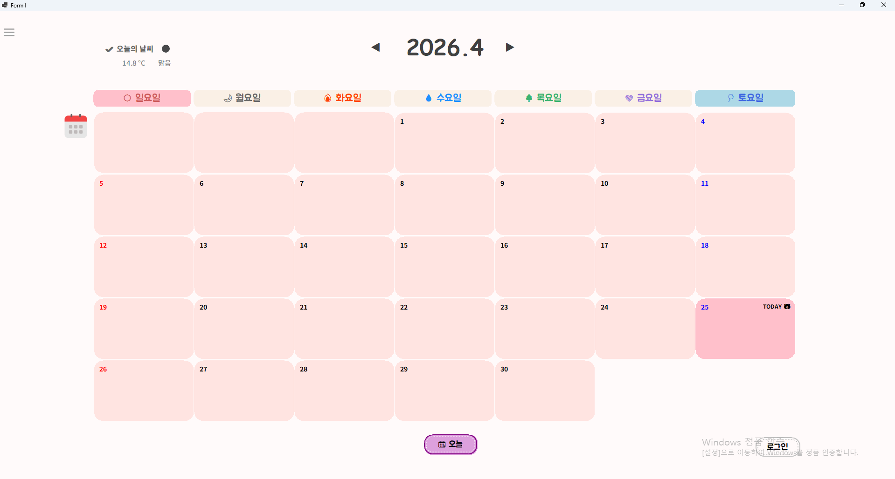 | 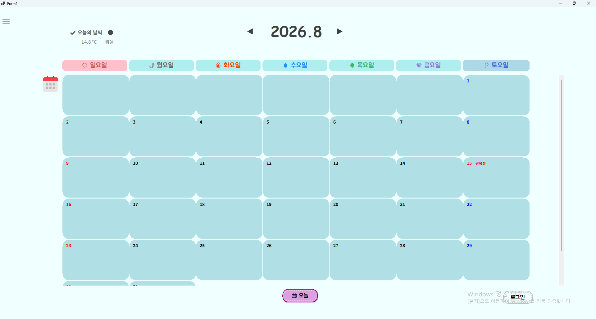 | 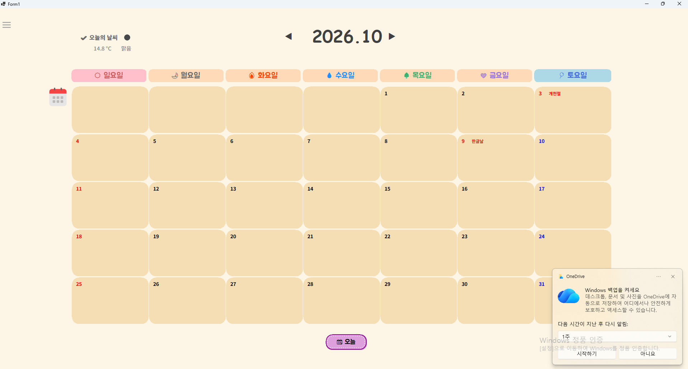 | 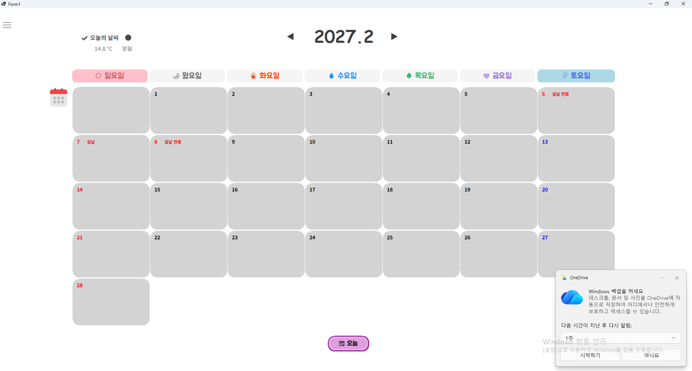 |

<br/>

### 📝 일정 관리 (CRUD + 반복)

| 일정 등록 | 일정 상세 | 반복 일정 | 일정 삭제 |
|:---------:|:---------:|:---------:|:---------:|
| 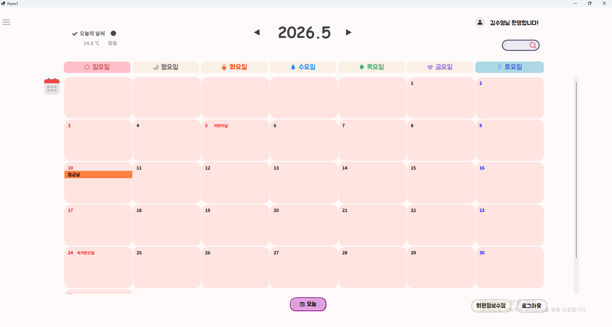 | 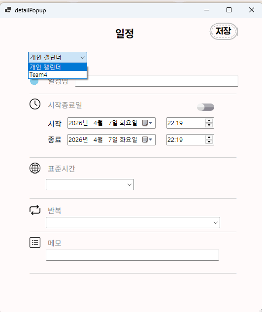 | 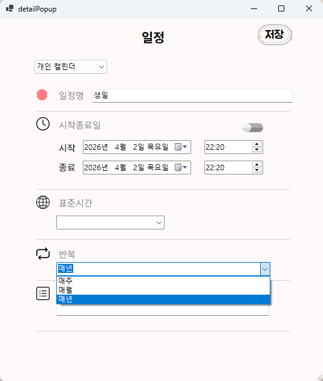 | 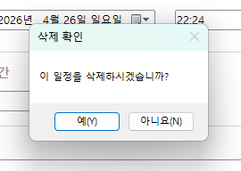 |

<br/>

### 👥 공유 캘린더

| 그룹 생성 | 팀원 추가 | 공유 일정 |
|:---------:|:---------:|:---------:|
| 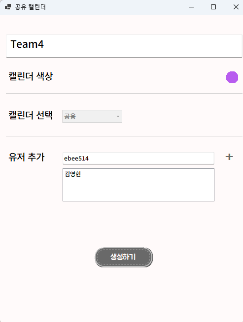 | 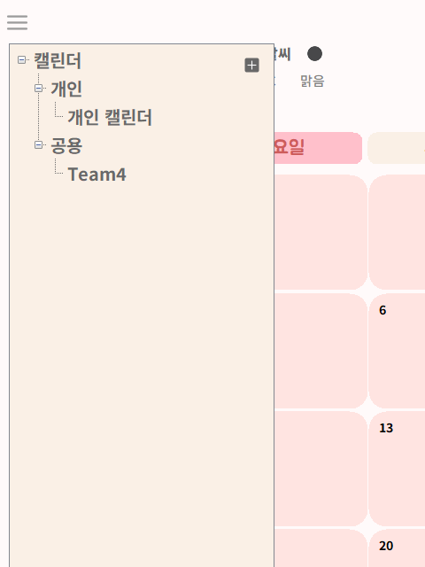 | 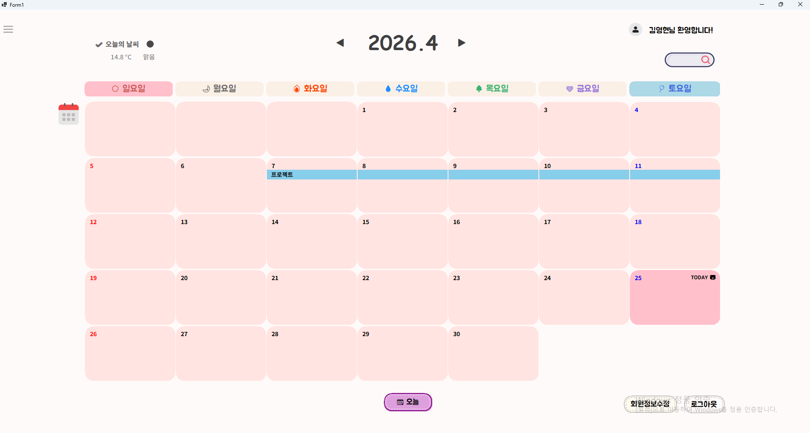 |

<br/>

### 🔐 회원 기능 · 외부 연동

| 로그인 | 비밀번호 찾기 | 날씨 API | Google 연동 |
|:------:|:------------:|:--------:|:-----------:|
| 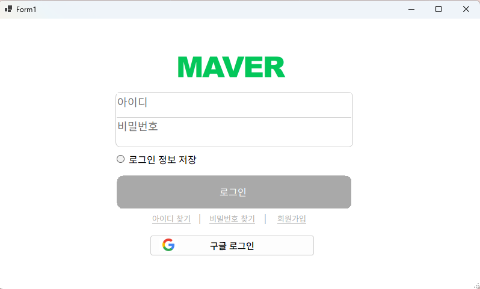 | 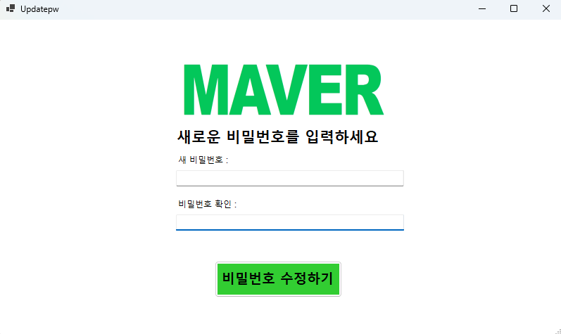 | 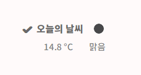 | 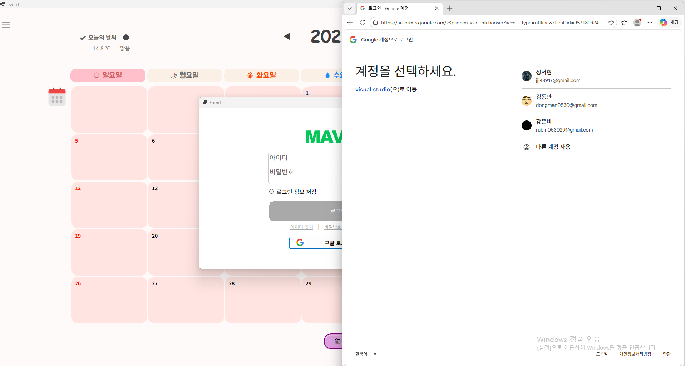 |

<br/>

### 📅 부가 기능

| 오늘 이동 | 공휴일 표시 | 일정 시각화 |
|:---------:|:-----------:|:-----------:|
| 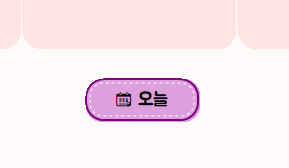 | 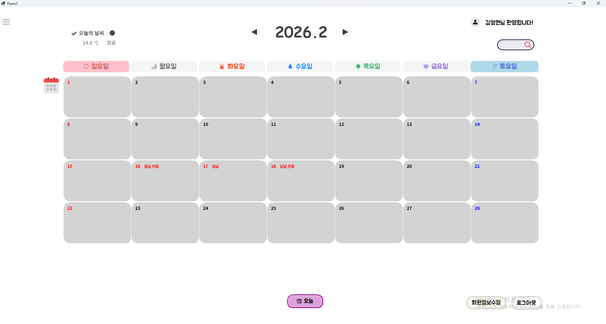 | 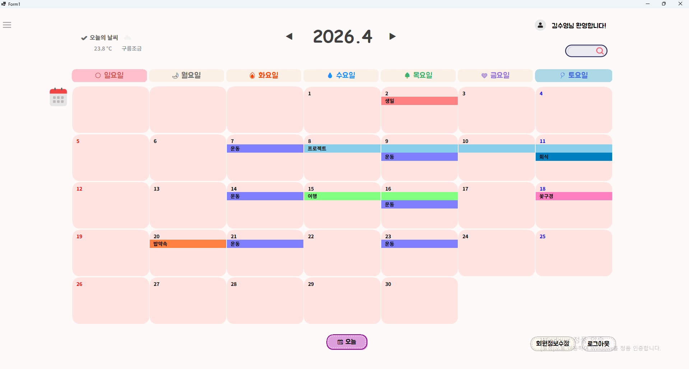 |

<br/>

---

<br/>

## ⚙️ 주요 기능 상세

<table>
  <tr>
    <td width="50%" valign="top">
      <h3>📆 캘린더 · 일정</h3>
      <p>
        <b>▸ 캘린더 메인</b> — 월별 뷰에서 일정 한눈에 확인<br/>
        <b>▸ 일정 CRUD</b> — 날짜 클릭 → 등록 · 수정 · 삭제<br/>
        <b>▸ 반복 일정</b> — 매일 / 매주 / 매월 / 매년 주기 설정<br/>
        <b>▸ 연속 일정</b> — 여러 날에 걸친 일정 시각적 표시<br/>
        <b>▸ 일정 검색</b> — 일정명 · 기간 기준 필터링<br/>
        <b>▸ 계절 테마</b> — 봄 · 여름 · 가을 · 겨울 자동 변경<br/>
        <b>▸ 공휴일</b> — 공휴일 및 주말 색상 구분<br/>
        <b>▸ 오늘 이동</b> — 원클릭으로 현재 날짜 이동
      </p>
    </td>
    <td width="50%" valign="top">
      <h3>🤝 공유 · 연동</h3>
      <p>
        <b>▸ 공유 캘린더</b> — 그룹 생성 · 멤버 초대 · 권한 관리<br/>
        <b>▸ 카테고리</b> — 개인 / 공용 캘린더 TreeView 분리<br/>
        <b>▸ 일정 필터링</b> — 선택된 캘린더 기준 일정만 표시<br/>
        <b>▸ 날씨 API</b> — OpenWeather 실시간 날씨 연동<br/>
        <b>▸ Google 연동</b> — OAuth 기반 로그인 · 캘린더<br/>
        <b>▸ 회원 관리</b> — 회원가입 · 로그인 · 비밀번호 찾기<br/>
        <b>▸ 그룹 관리</b> — 관리자/일반 권한 · 탈퇴 · 삭제
      </p>
    </td>
  </tr>
</table>

<br/>

---

<br/>

## 🤝 공유 캘린더 시스템 심층 분석

> 사용자 간 협업을 위한 **그룹 기반 공유 캘린더** 아키텍처

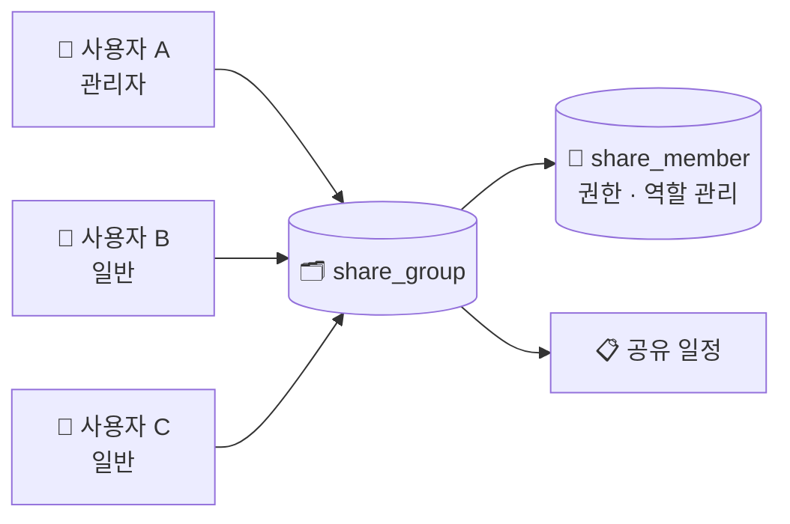

<table>
  <tr>
    <th>🔧 기능</th>
    <th>💻 구현 포인트</th>
  </tr>
  <tr>
    <td>개인 / 공용 캘린더 분리</td>
    <td>TreeView를 활용한 캘린더 UI 구성</td>
  </tr>
  <tr>
    <td>공유 그룹 생성 · 멤버 초대</td>
    <td><code>share_group</code>, <code>share_member</code> 관계형 DB 설계</td>
  </tr>
  <tr>
    <td>관리자 / 일반 권한 분리</td>
    <td>로그인 사용자 ID 기준 접근 가능 캘린더 조회</td>
  </tr>
  <tr>
    <td>선택 캘린더 기준 필터링</td>
    <td>선택된 캘린더의 일정만 메인 화면에 표시</td>
  </tr>
</table>

<br/>

---

<br/>

## 🔄 시스템 흐름도

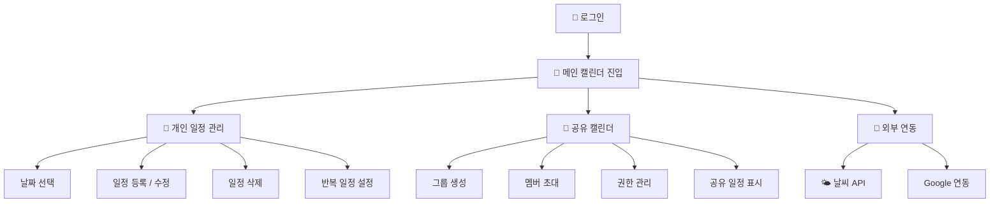

<br/>

---

<br/>

## 🗂️ 프로젝트 구조

```
📦 Maver_Calendar/
├── 📄 README.md
├── 📄 Maver_Calendar.sln
├── 📂 Project_Maver/
│   ├── 📄 Program.cs                # 진입점
│   ├── 📂 View/                     # UI 폼 (캘린더, 로그인, 공유 등)
│   ├── 📂 Common/                   # 비즈니스 로직 (DB, 날씨, 세션)
│   └── 📂 Resources/                # 리소스 및 에셋
├── 📂 images/                       # 스크린샷
└── 📂 demo/                         # 시연 영상
```

<br/>

---

<br/>

## 🛠️ 기술 스택

<table>
  <tr>
    <th align="center">Language</th>
    <th align="center">Framework</th>
    <th align="center">Database</th>
    <th align="center">IDE</th>
    <th align="center">API</th>
    <th align="center">협업 도구</th>
  </tr>
  <tr>
    <td align="center">
      
    </td>
    <td align="center">
      
    </td>
    <td align="center">
      
    </td>
    <td align="center">
      
    </td>
    <td align="center">
      <br/>
      
    </td>
    <td align="center">
      <br/>
      
    </td>
  </tr>
</table>

<br/>

---

<br/>

## 🚀 실행 방법

```bash
# 1. 저장소 클론
git clone https://github.com/your-username/Maver_Calendar.git

# 2. Visual Studio 2022에서 Maver_Calendar.sln 열기

# 3. MySQL DB 연결 정보 설정 (Common/ 내 설정 파일)

# 4. 빌드 및 실행
F5 또는 Ctrl + F5
```

<br/>

---

<br/>

## 📈 기대 효과

### 🙋 사용자 편의성
월별 캘린더 화면에서 등록된 일정을 직관적으로 확인할 수 있으며, 반복 일정과 연속 일정을 한 번에 관리할 수 있습니다. 날씨 정보, 공휴일, 오늘 날짜까지 하나의 화면에서 통합적으로 제공하여 별도의 앱 전환 없이 필요한 정보를 빠르게 파악할 수 있습니다.

### 🤝 협업 효율성
공유 캘린더를 통해 팀원 간 일정을 실시간으로 공유할 수 있고, 그룹별로 일정을 분리 관리하여 협업 효율을 극대화할 수 있습니다. 개인 일정과 공용 일정이 깔끔하게 분리되어 있어 업무와 개인 스케줄이 섞이지 않습니다.

### 🚀 향후 확장 계획
Google Calendar 양방향 동기화, 일정 알림 및 푸시 기능, 월간 리포트와 통계 대시보드 등을 추가할 계획입니다. 또한 다크모드와 색상 커스터마이징을 지원하고, 나아가 모바일 및 웹 버전으로 확장하여 더 넓은 환경에서 사용할 수 있도록 발전시킬 예정입니다.

<br/>

---

<br/>

## 👥 팀 구성

<table>
  <tr>
    <th align="center">이름</th>
    <th align="center">역할</th>
    <th align="center">담당</th>
  </tr>
  <tr>
    <td align="center"><b>김영현</b></td>
    <td align="center">👑 팀장</td>
    <td>캘린더 UI 및 공유 캘린더 관리</td>
  </tr>
  <tr>
    <td align="center"><b>강은비</b></td>
    <td align="center">팀원</td>
    <td>DB 설계 및 캘린더 구현</td>
  </tr>
  <tr>
    <td align="center"><b>김수영</b></td>
    <td align="center">⭐ 팀원</td>
    <td><b>UI 디자인 · API 연동 · 연속 및 반복 일정 로직 · 일정 시각화</b></td>
  </tr>
  <tr>
    <td align="center"><b>이승환</b></td>
    <td align="center">팀원</td>
    <td>일정 CRUD 및 기능 연동</td>
  </tr>
  <tr>
    <td align="center"><b>정서현</b></td>
    <td align="center">팀원</td>
    <td>로그인 및 회원 기능</td>
  </tr>
</table>

<br/>

---

<p align="center">
  <sub>© 2025 Maver Calendar Team · Built with ❤️</sub>
</p>
