# 📅 일정관리 프로그램 — Maver Calendar

  
  
  

  C# WinForms + MySQL 기반 데스크톱 일정 관리 프로그램 
  개인 캘린더와 공유 캘린더를 통합하여 직관적으로 일정을 관리합니다.

---

## 📌 프로젝트 개요

WinForms와 MySQL을 기반으로, 누구나 쉽고 안정적으로 사용할 수 있는 일정 관리 프로그램입니다.
공용 캘린더와 개인 캘린더를 월별로 한눈에 확인하고, 반복 일정 및 기간별 검색까지 지원합니다.

---

## ⚙️ 주요 기능

| 기능 | 설명 |
|------|------|
| **캘린더 메인** | 계절별 테마 색상 자동 변경, 공휴일·오늘 날짜 표시 |
| **일정 CRUD** | 날짜 클릭으로 일정 등록, 상세보기·수정·삭제 지원 |
| **반복 일정** | 매주·매월·매년 단위 반복 설정 및 종료일 관리 |
| **연속 일정** | 동적 슬롯 할당으로 날짜 겹침 없이 멀티데이 일정 표시 |
| **카테고리** | 개인/공용 캘린더 분리, 공유 멤버 초대 및 탈퇴 |
| **일정 검색** | 일정명 키워드 및 기간 조건으로 필터링 |
| **날씨 API** | OpenWeather API 연동으로 오늘 날씨 실시간 표시 |
| **소셜 로그인** | Google OAuth 2.0 연동, 토큰 기반 계정 인증 |
| **회원 관리** | 회원가입·로그인·아이디 찾기·임시 비밀번호 이메일 발송 |

---

## 🔄 흐름도

### 로그인 흐름
> 랜딩 화면 → 계정 확인 → 로그인 → 아이디/비밀번호 찾기 → 메인 화면 진입

### 일정 관리 흐름
> 캘린더 화면 → 날짜 선택 → 일정 등록 → DB 저장 → 화면 반영 → 상세보기·수정·삭제

### 카테고리 관리 흐름
> 캘린더 화면 → 카테고리 버튼 → 개인/공용 캘린더 생성 → 멤버 초대 → DB 연동

---

## 🖥️ 소프트웨어 화면

### 메인 캘린더
계절에 따라 테마 색상이 자동으로 변경되며, 공휴일·오늘 날짜·등록된 일정이 한눈에 표시됩니다.

| 봄 테마 | 여름 테마 | 가을 테마 | 겨울 테마 |
|:---:|:---:|:---:|:---:|
| 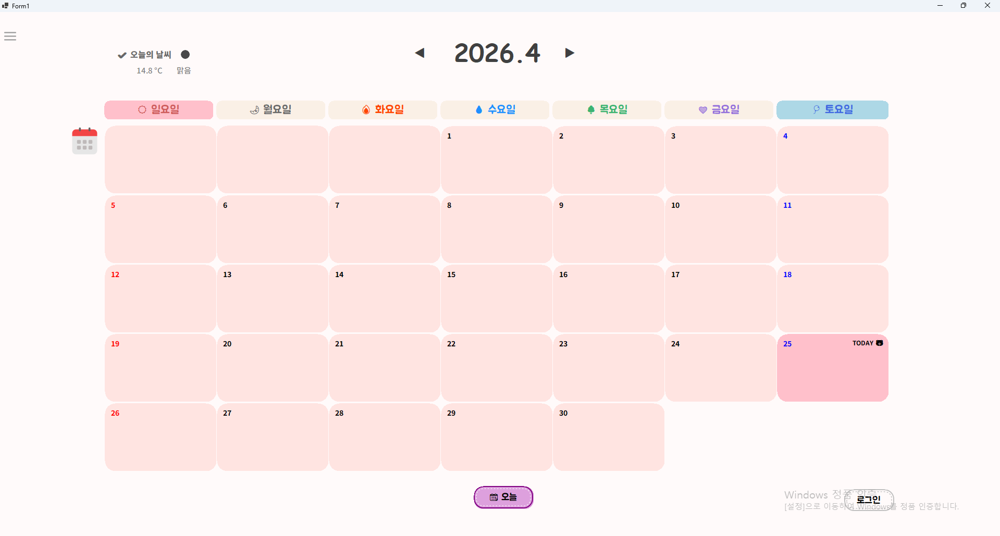 | 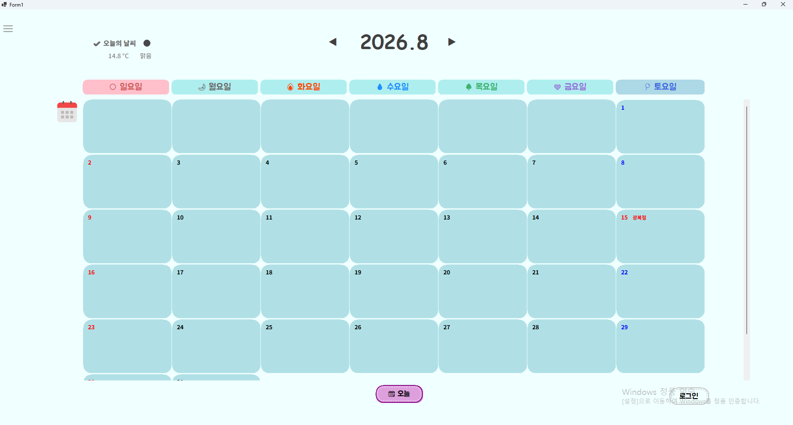 | 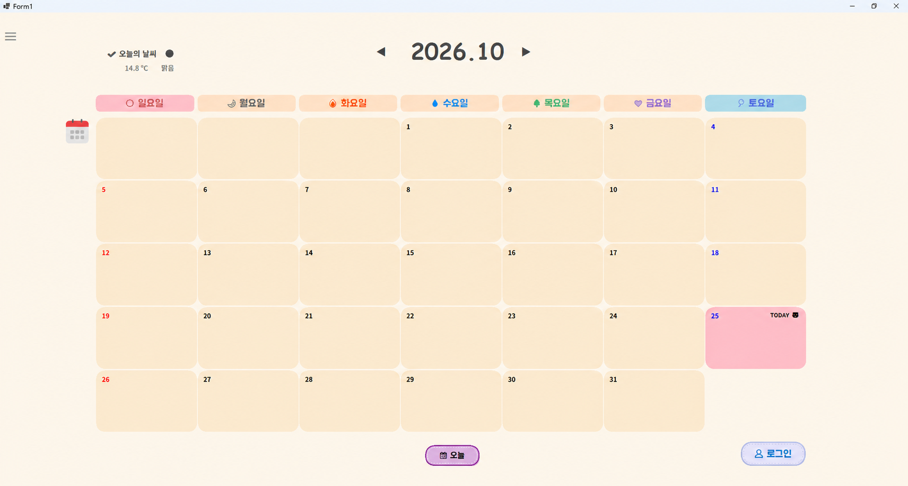 | 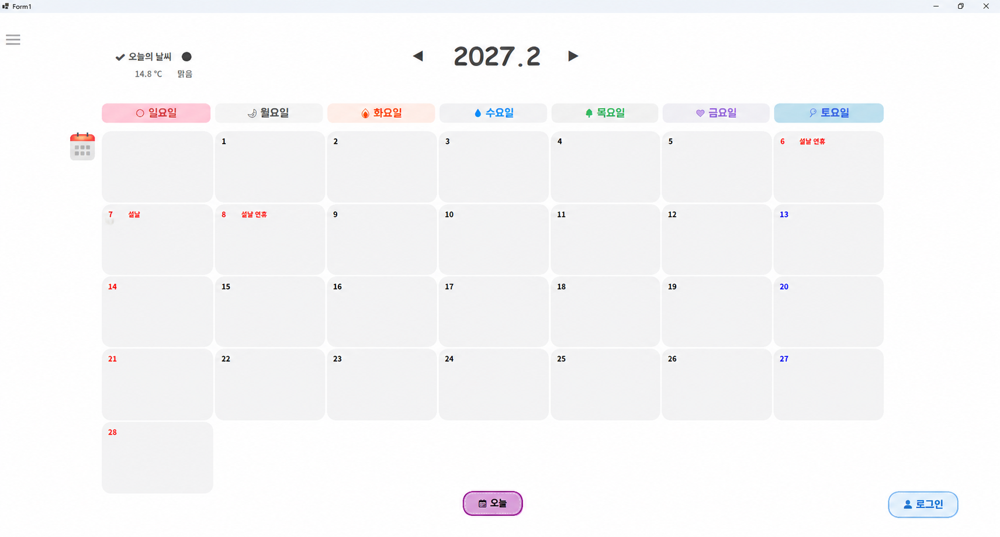 |

### 공용 캘린더
공용 캘린더 생성 및 멤버 초대, 추가가 가능합니다.

| 공용 캘린더 | 인원 추가 | 캘린더 추가 |
|:---:|:---:|:---:|
| 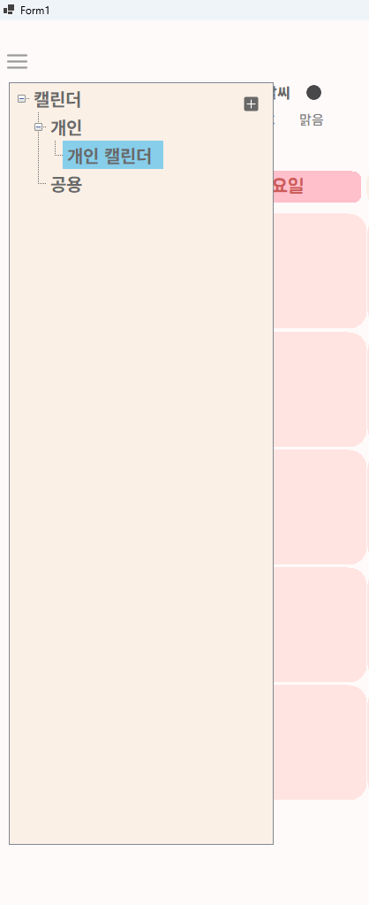 |  |  |

### 일정 관리
날짜를 클릭하면 일정 등록 팝업이 열리며, 반복 일정 설정도 지원합니다.

| 일정 추가 | 반복 일정 추가 | 일정 추가 확인 | 연속·반복 일정 |
|:---:|:---:|:---:|:---:|
| 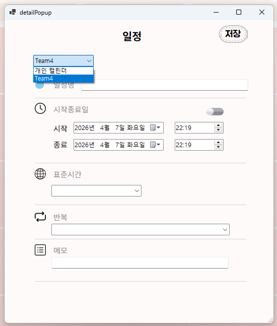 | 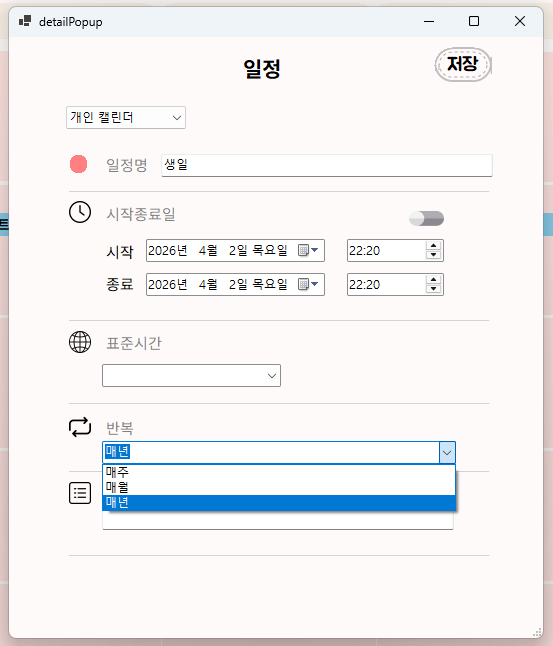 | 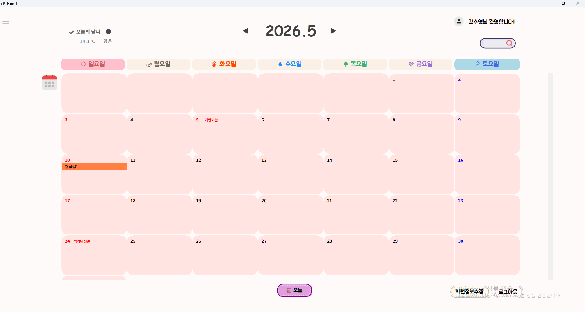 |  |

### 회원 관리
회원가입, 로그인, 비밀번호 찾기를 지원합니다.

| 회원가입 | 로그인 | 비밀번호 찾기 |
|:---:|:---:|:---:|
| 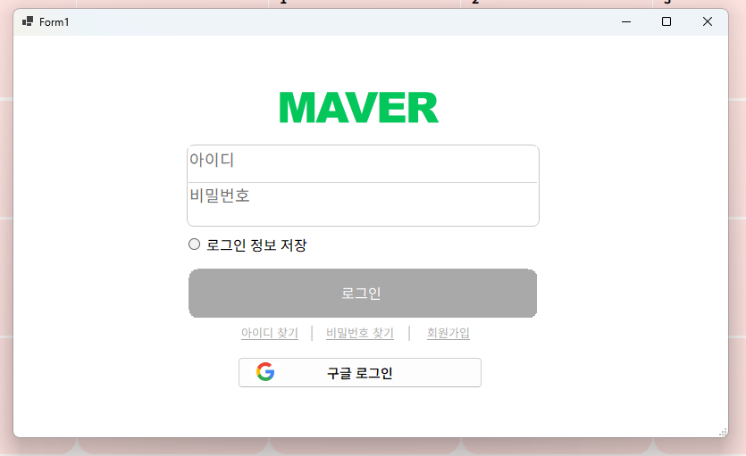 | 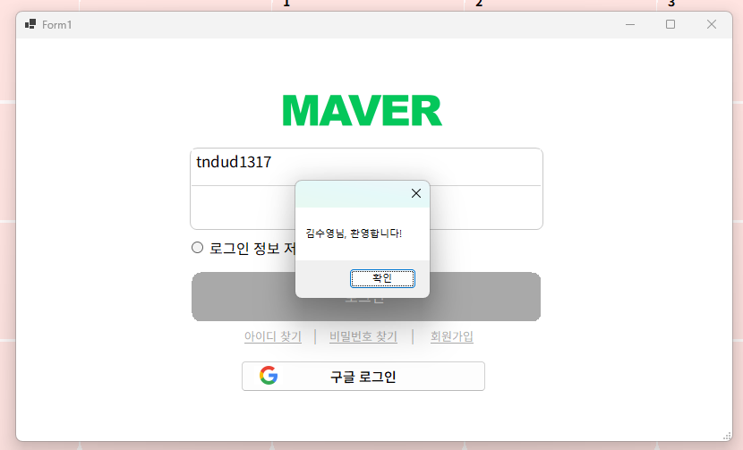 | 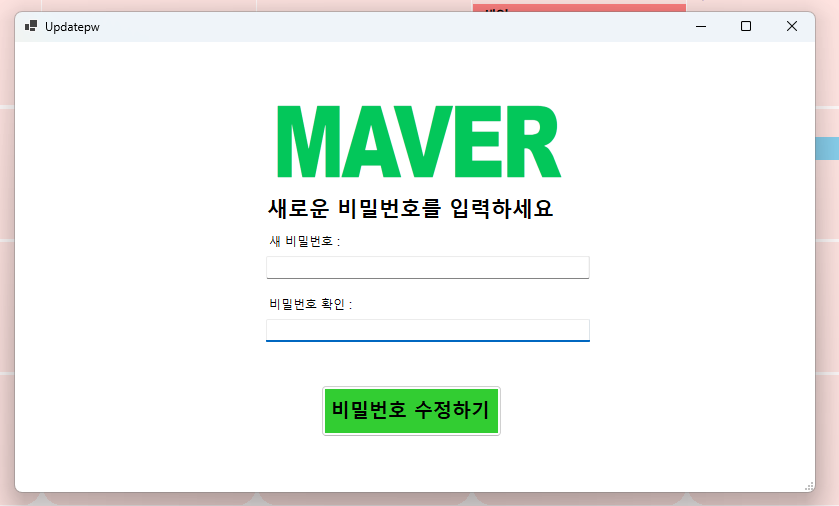 |

### API 연동
날씨 API와 Google 소셜 로그인 API를 연동합니다.

| 날씨 API | 날씨 추가 | 구글 API |
|:---:|:---:|:---:|
| 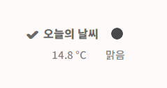 | 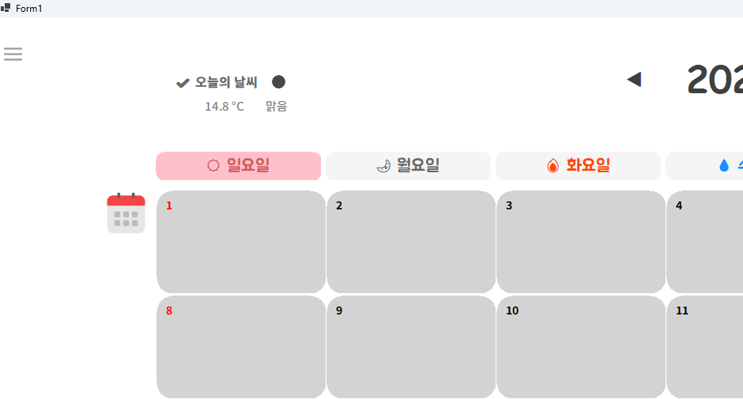 | 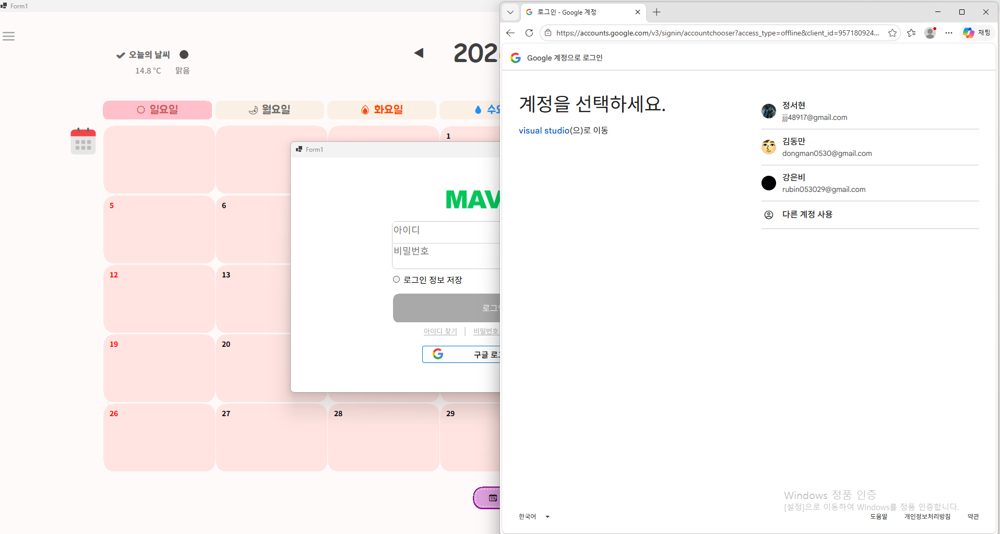 |

### 기타
공휴일 표시 및 일정 상세보기 기능을 제공합니다.

| 공휴일 | 상세보기 |
|:---:|:---:|
| 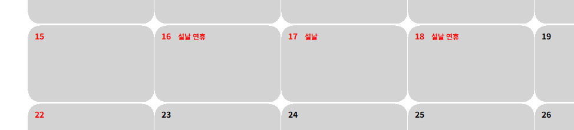 | 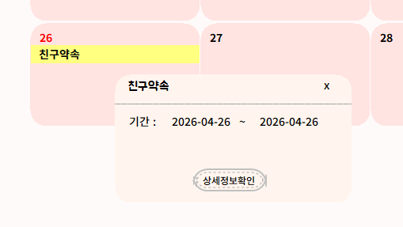 |

---

## 📈 기대 효과

- **운영 효율성 향상** : RDBMS 기반의 안정적인 데이터 관리로 일정 정보의 정확성을 확보합니다.
- **사용자 편의성 개선** : 복잡한 메뉴 없이 날짜 클릭만으로 일정을 등록·관리할 수 있습니다.
- **협업 지원** : 공유 캘린더를 통해 팀·그룹 단위의 일정을 함께 관리할 수 있습니다.
- **확장 가능성** : Google 소셜 로그인, 날씨 API 연동으로 외부 서비스와의 확장성을 확보합니다.

---

## 🎬 시연 영상

> 클릭하면 영상으로 이동합니다.

---

## 🛠️ 기술 스택

- **Language** : C#
- **Framework** : .NET Framework (WinForms)
- **Database** : MySQL
- **IDE** : Visual Studio
- **협업 도구** : GitHub, Sourcetree

---

## 👥 팀 구성

| 이름 | 역할 |
|------|------|
| 김영현 | 팀장 · 캘린더 메인 UI · 공유 캘린더 생성/관리 |
| 강은비 | DB 설계 · 환경 세팅 · 캘린더 메인 화면 구현 |
| **김수영** | **전체 UI 디자인 · 날씨·소셜 로그인 API · 반복 일정 · 일정 상세 출력** |
| 이승환 | DB 설계 보조 · 일정 CRUD · 기능 간 연동 |
| 정서현 | 로그인·회원가입 · 아이디/비밀번호 찾기 · 임시 비밀번호 발송 |
